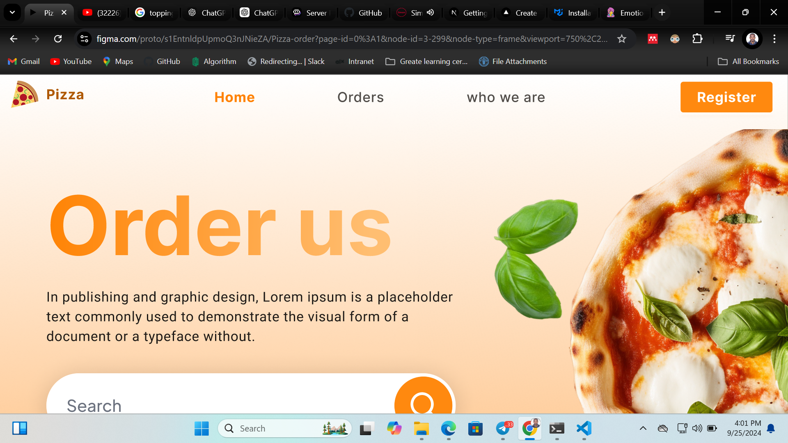

# ROLE BASED PIZZA DELIVERY
role-based pizza delivery web application, built with Next.js, Express.js, and PostgreSQL. For secure, role-based authentication, I integrated CASL authorization on the frontend. I crafted a sleek and engaging UI with Material UI components, and for a responsive, feature-rich table experience, I utilized Material React Table. I’m particularly proud of the advanced logic incorporated throughout the app, which I completed in just one week! To boost performance, I leveraged the useMemo hook, significantly reducing load times by optimizing heavy computations on re-renders. Additionally, I implemented lazy loading for static images, ensuring a smooth and fast user experience. the website

## Demo

https://pizza-order-kappa.vercel.app/